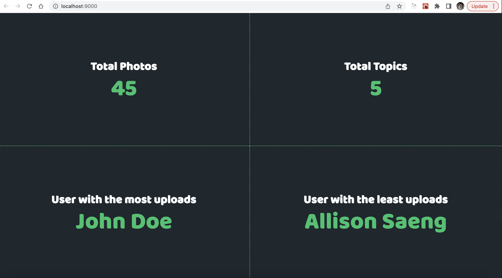
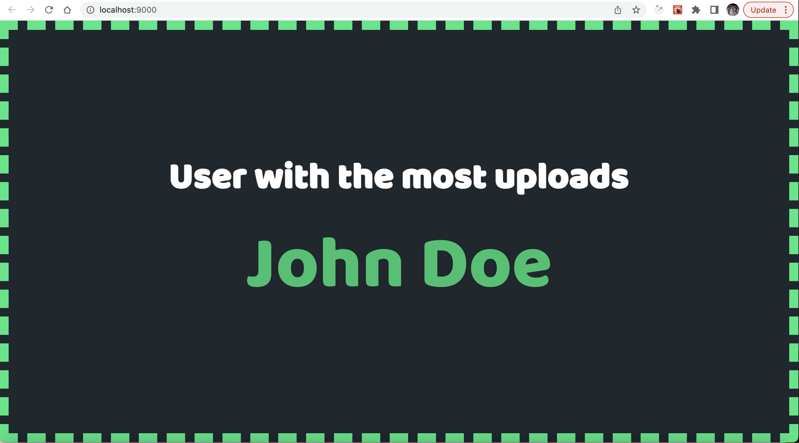

# PhotoLabs Dashboard
PhotoLabs Dashboard displays the data of photolabs. it fetches the data from server and display the particular information after calculating with helper methods.

# PhotoLabs Dashboard Screenshots



## Setup

Install dependencies with `npm install`.

## Running Webpack Development Server

```sh
npm start
```

## Running Jest Test Framework

```sh
npm test
```
